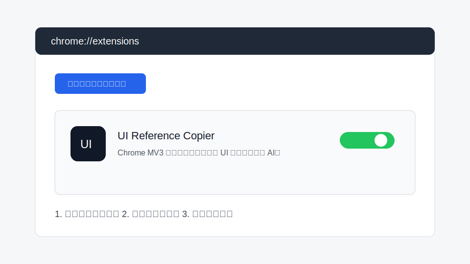
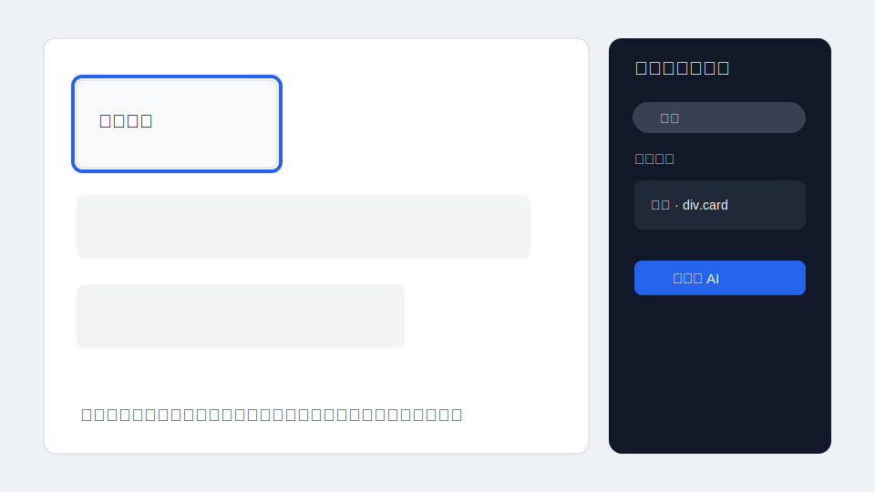
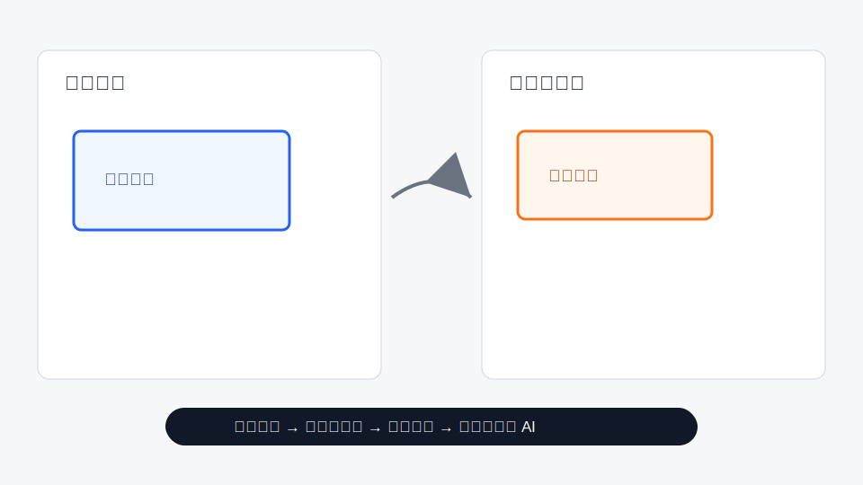
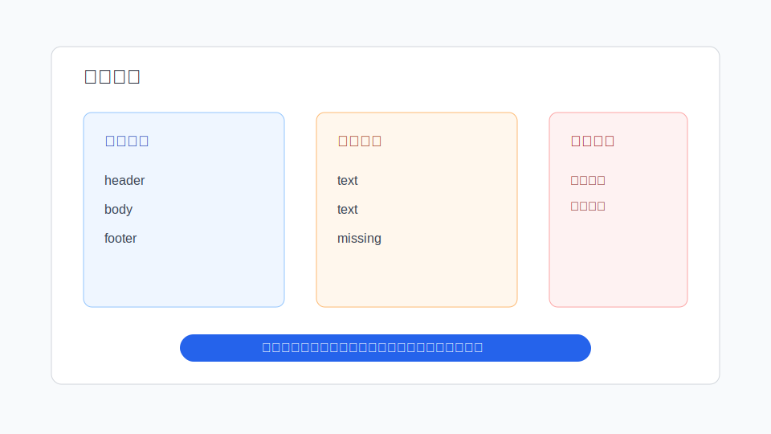
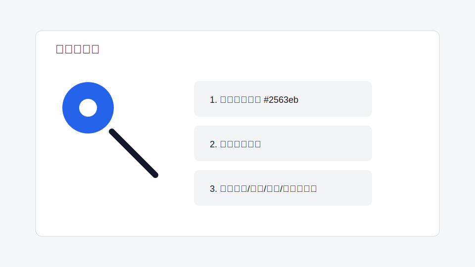

# UI Reference Copier 使用指南

这份文档面向第一次使用插件的人，目标是让你不打开 DevTools，也能把参考页面里的 UI 信息复制给 Codex、Claude Code、Cursor 等 AI 编程工具。

## 1. 安装插件

1. 打开 Chrome 地址栏，输入 `chrome://extensions/`。
2. 开启右上角「开发者模式」。
3. 点击「加载已解压的扩展程序」。
4. 选择 `ui-reference-copier` 项目目录。
5. 安装后，点击浏览器右上角插件图标即可打开采集面板。

## 2. 采集一个参考元素

适合场景：你看到一个按钮、卡片、表格、菜单、统计块，想让 AI 在当前项目里还原它。

1. 打开参考页面。
2. 点击插件图标，打开面板。
3. 鼠标移动到页面元素上，插件会高亮当前元素。
4. 点击元素完成选择。
5. 如果选中范围太小，点「选择父级」。
6. 如果父级选过头了，点「回退」。
7. 在「采集」页点击「复制给 AI」。
8. 把提示词粘贴给 Codex / Claude Code。

建议：

- 只想要外层容器时，子元素采样可以选「不采集」。
- 要还原内部标题、按钮、图标时，建议保留标准或详细子元素采样。
- 如果参考页不是当前项目页面，可以打开「外部参考页模式」，避免模型照搬参考页 class。

## 3. 跨页面对比

适合场景：你已经有一个当前实现页，但和参考页不够像，需要让 AI 按差异修。

1. 在参考页打开插件。
2. 选中参考元素。
3. 切到「单组对比」。
4. 点击「设为参考」。
5. 切换到当前实现页面。
6. 选中当前页面对应元素。
7. 点击「对比参考」。
8. 点击「复制差异给 AI」。

### 样式对比范围怎么选

如果参考和当前使用的是同一个组件结构，可以选「包含子元素」。

如果参考和当前来自不同 UI 组件库，例如 Naive UI 对 Element Plus，建议先选「只对比当前元素」。这样提示词会先关注根容器、整体尺寸、背景、字体和结构风险，不会被内部 DOM 差异带偏。

等根容器和结构基本对齐后，再切回「包含子元素」，排查内部标题、按钮、图标、菜单行等细节。

## 4. 多组元素对比

适合场景：一个页面里有多个区域要分别还原，例如 4 个指标卡片、图表卡片、表格区域和操作栏。

1. 在参考页选中第一组元素。
2. 切到「多组对比」。
3. 点击「保存新参考组」。
4. 继续选择其他参考区域，重复保存。
5. 切到当前实现页。
6. 在下拉框里选择要匹配的参考组。
7. 选中当前页面对应元素。
8. 点击「匹配当前组」。
9. 每组都匹配后，点击「对比全部组」。
10. 点击「复制精简差异」或「复制详细差异」。

快捷键：

- `Cmd / Ctrl + S`: 保存新参考组。
- `Cmd / Ctrl + D`: 匹配当前组。

多组对比也支持「样式对比范围」。跨组件库场景建议先只对比当前元素，减少内部 DOM 噪音。

## 5. 结构对比

适合场景：AI 按样式差异修了很多次，还是不像。通常这说明两边选中的层级不一致，或者当前页面缺少结构。

1. 切到「结构对比」。
2. 在参考页选中正确范围。
3. 点击「设为结构参考」。
4. 切到当前实现页，选中对应范围。
5. 点击「设为当前结构」。
6. 点击「对比结构」。
7. 如果提示结构明显不一致，先让 AI 修 DOM / 组件 / 布局结构。
8. 结构对齐后，再回到样式对比。

### 结构采样深度怎么选

- 精简：适合普通卡片、按钮、简单容器。
- 中等：默认选择，适合大多数区域。
- 全量：适合长菜单、侧边栏导航、复杂导航树。

如果你在对比菜单，建议选「全量」，并重新保存结构参考和当前结构后再对比。

## 6. 菜单 / 导航怎么对比

菜单是最容易误导 AI 的组件之一，因为不同 UI 库内部 DOM 经常完全不一样。

推荐流程：

1. 先做结构对比。
2. 结构采样深度选「全量」。
3. 看「组件语义差异」，重点确认菜单项、层级、顺序、展开态和选中态。
4. 再做单组样式对比。
5. 样式对比范围先选「只对比当前元素」。
6. 根容器和整体视觉对齐后，再切到「包含子元素」排查菜单行、图标、文字、箭头等细节。

注意：

- 不要让 AI 照搬参考页的 `div / ul / li / span` 数量。
- 不要让 AI 照搬参考组件库变量，例如 `--n-*`。
- 应优先保留当前项目已有菜单组件、路由配置或菜单数据源。

## 7. 取色

适合场景：你只是想从一个页面吸取颜色，再应用到当前项目某个元素上。

1. 切到「取色」。
2. 点击「开始吸色」。
3. 用吸管点击屏幕上的颜色点。
4. 切到目标页面。
5. 点击「选择目标元素」。
6. 选择颜色应用方式：自动、背景色、文字色、边框色、图标色、阴影色或主题变量。
7. 点击「复制颜色修改提示词」。

取色不会要求 AI 改布局、尺寸、字体或 DOM 结构。它只解决颜色同步问题。

## 8. 常见问题

### 为什么 AI 还是改不像？

优先检查是否结构不一致。很多时候不是颜色和间距问题，而是当前实现缺少容器、标题区、操作区、菜单层级或图表结构。

### 为什么不要总是复制完整 JSON？

完整 JSON 很长，容易浪费 token，也容易让模型抓不住重点。默认提示词已经整理了关键字段。只有在复杂排查时才建议复制 JSON 或完整 computed CSS。

### 为什么有些未展开菜单项读不到？

插件只能读取浏览器 DOM 里已经渲染出来的内容。如果组件库在未展开时没有把子菜单挂到 DOM，插件无法凭空知道这些菜单项。可以先展开菜单，再重新采集。

### 什么时候用「只对比当前元素」？

当参考页和当前页使用不同组件库，或者内部 DOM 差异很大时，先只对比当前元素。这样可以先解决根容器、尺寸、背景、字体、结构风险，再逐步进入内部细节。

### 什么时候用「包含子元素」？

当两边结构已经基本一致，或者你需要排查内部标题、按钮、图标、进度条、菜单项行高和缩进时，再包含子元素。

## 9. 推荐工作流

最稳的流程是：

1. 先采集或对比根容器。
2. 如果结构风险高，先做结构对比。
3. 结构一致后，再做样式对比。
4. 跨组件库时先只对比当前元素。
5. 根容器对齐后，再包含子元素。
6. 只需要颜色时，用取色，不要走完整对比。

这个流程能减少 AI 误判，也能减少来回修改次数。
